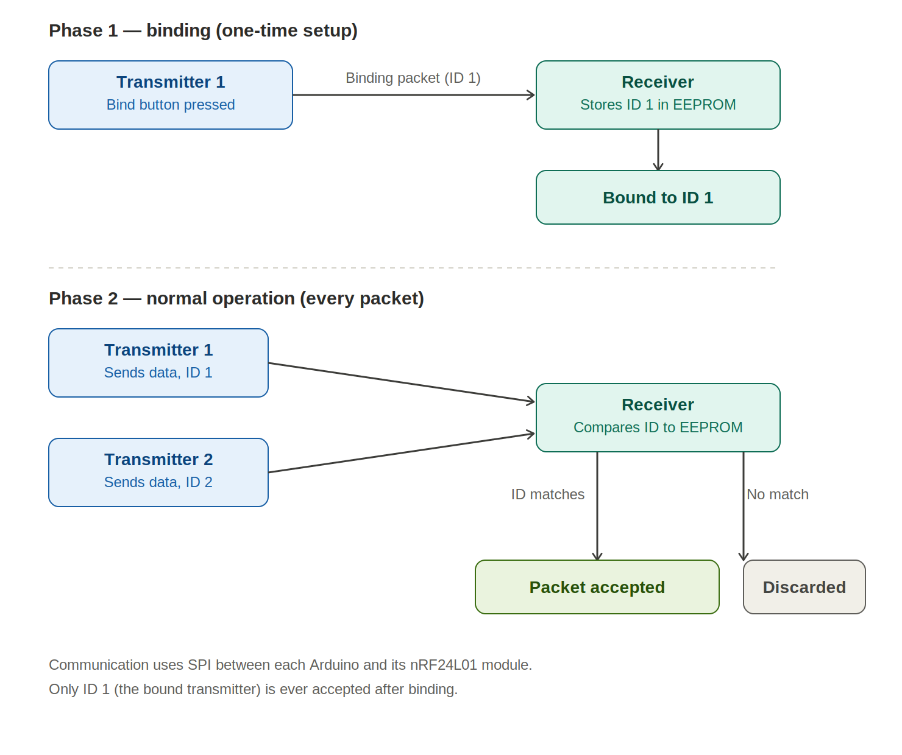

# nRF24L01 Wireless Binding System

A custom wireless pairing system built with nRF24L01 transceivers, where a receiver accepts commands only from a transmitter it has been explicitly bound to — the same pairing concept used in commercial RC transmitters, drones, and wireless remotes.

## Overview

Plain RF communication is point-to-point but not selective — any transmitter broadcasting on the same channel can be picked up by any receiver in range. This project adds a binding (pairing) layer on top of nRF24L01 communication so the receiver only ever acts on packets from one authorized transmitter, ignoring everyone else, even other transmitters using identical hardware nearby.

The system uses three Arduino boards:
- **Transmitter 1** and **Transmitter 2** — independent transmitters, each with its own nRF24L01 module and a unique transmitter ID
- **Receiver** — a single Arduino with its own nRF24L01 module, listening continuously and storing the ID of its bound transmitter in EEPROM

## Binding Flow

## Features

- Custom transmitter-receiver binding mechanism (not simple always-on RF pairing)
- EEPROM-based pairing memory — the bound transmitter ID persists across power cycles
- Per-packet ID validation — every incoming packet is checked before being processed
- Rejects packets from any unbound or unauthorized transmitter
- SPI-based communication between each Arduino and its nRF24L01 module

## Hardware

| Component | Details |
|---|---|
| Microcontrollers | Arduino Uno, Nano, and Mega (used across transmitter/receiver roles during development) |
| RF Modules | 3x nRF24L01 (standard and PA/LNA variants tested) |
| Interface | SPI (MOSI, MISO, SCK) + CE/CSN control pins |
| Power | Stable 3.3V supply to each RF module |

## Software & Libraries

- Arduino IDE
- RF24 library — nRF24L01 communication
- Arduino EEPROM library — non-volatile storage of the bound transmitter ID
- Serial Monitor — used extensively for debugging packet transmission and binding status

## How It Works

**Phase 1 — Binding (one-time setup)**
1. On first boot, the receiver has no transmitter paired and sits in an unbound state.
2. Pressing the dedicated binding button on a transmitter sends a special binding packet containing that transmitter's unique ID.
3. The receiver saves this ID to EEPROM, permanently associating itself with that transmitter until binding is intentionally repeated.

**Phase 2 — Normal Operation (every packet)**
1. Bound and unbound transmitters both continuously send data packets at regular intervals, each carrying their own transmitter ID.
2. Before processing any packet, the receiver compares its ID against the one stored in EEPROM.
3. Matching packets are accepted and processed; everything else is discarded immediately.

This project focuses on selective wireless communication through ID-based binding — it does not implement RF encryption, frequency hopping, mesh networking, LoRa, Bluetooth, Wi-Fi, cryptographic authentication, or other advanced wireless networking protocols.

## Tech Stack

`Arduino` `Embedded C++` `nRF24L01` `RF24 Library` `SPI` `EEPROM` `2.4 GHz RF Communication` `Device Pairing`

## Results

- Reliable selective communication — only the bound transmitter's packets are ever accepted
- EEPROM-based pairing confirmed to persist correctly across power cycles
- Verified stable operation across multiple Arduino boards and both standard and PA/LNA nRF24L01 variants

## Built During

Engineering Internship — i-WORKZ Automotive Pvt. Ltd.
